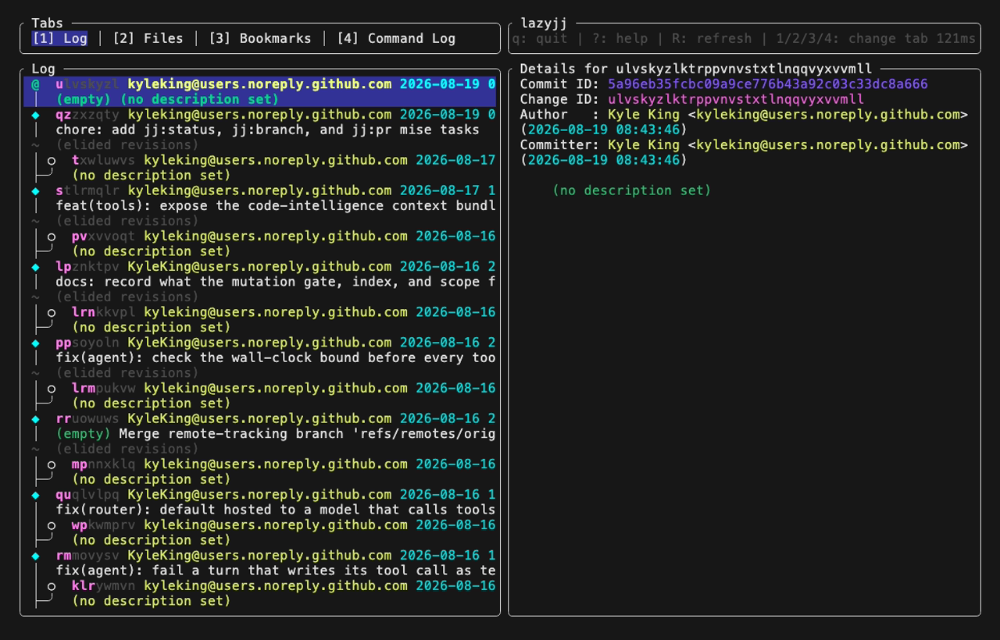
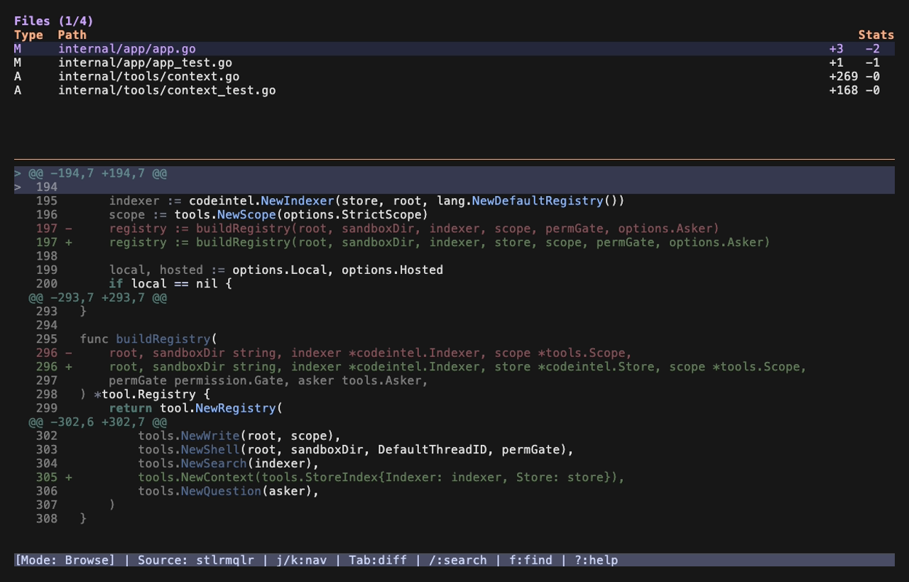

# jj TUI comparison

Screenshots for lazyjj and jj-diff were shot locally against `../wavez` (a colocated
jj/git repo) with `vhs`, since neither has a recent screenshot upstream: lazyjj's
GitHub and [lazyjj.dev](https://lazyjj.dev) have none at all, and jj-diff's own
`.github/assets/demo.gif` predates the Bubble Tea v2 migration
([6a06714](https://github.com/KyleKing/jj-diff/commit/6a06714), Aug 1) by seven months.
jjui and madicen/jj-tui both ship recent, actively maintained GIFs in their READMEs, so
those are linked rather than re-shot.

## Ratings (1-5, functionality only)

| | Log/graph browsing | Diff viewing | GitHub/PR integration | Extensibility | Maturity |
|---|---|---|---|---|---|
| [lazyjj](#lazyjj) | 3 | 2 | 1 | 1 | 3 |
| [jjui](#jjui) | 5 | 3 | 2 | 5 | 5 |
| [madicen/jj-tui](#madicenjj-tui) | 4 | 3 | 5 | 2 | 1 |
| [jj-diff](#jj-diff) | n/a (not its job) | 5 | 1 | 1 | 3 |

jj-diff isn't scored on log browsing because it doesn't do it by design, it's a diff
tool, not a repo browser. That's the throughline below: none of these four is a
complete replacement for lazygit on its own.

## lazyjj

[Cretezy/lazyjj](https://github.com/Cretezy/lazyjj), Rust/Ratatui, 1188 stars, last
push March 2026 (five months stale as of writing). Covers log browsing, bookmarks,
describe/squash, and `jj git push`/`fetch`, plus a command box for raw jj commands.
No PR listing, no ahead/behind, no extension point beyond that command box. This is
what you're on now, and the staleness matches the ceiling you're running into: the gap
isn't a bug to file, it's outside the project's scope as built.

## jjui

[idursun/jjui](https://github.com/idursun/jjui), Go/Bubble Tea (same stack as
jj-diff), 2109 stars, pushed yesterday, 48 open issues (a live project, not a dead
one). Strongest log/graph/op-log browsing of the four, plus revset filtering,
workspace management, batch multi-select operations, and external editor hooks
(Cursor, VS Code, Zed, Neovim).

As of v0.10 it replaced its old leader-key/custom-command config with a Lua
actions/bindings system: actions get full context (change id, bookmark, revset, file),
can run arbitrary commands, read output, update the revset, and show flash
messages or open pickers. That's a real extension point for wiring in `gh pr
status`/`gh pr view` yourself, which is the actual lazygit-equivalent gap you're
naming. I could not confirm from the docs (the live config page 404'd on fetch)
whether a Lua action can render something richer than a flash message or picker, e.g.
a scrollable PR list pane, so verify that before betting the GitHub workflow on it.

## madicen/jj-tui

[madicen/jj-tui](https://github.com/madicen/jj-tui), Go/Bubble Tea, 2 stars, created
February 2026. This is the only one of the four with GitHub PR support built in:
device-flow auth, PR list with CI status and review indicators, `gh repo create`
bootstrapping, and ticket linking across GitHub Issues/Jira/Codecks. It's exactly the
shape of UI you're asking for, but it's a two-star project five months old with no
track record. Worth reading as a design reference for what the PR pane should look
like, not as something to depend on yet.

## jj-diff

This repo. Deliberately scoped to diff viewing and hunk/line movement between
revisions, it isn't a log browser or a GitHub client and was never meant to be one.
The diff rendering (syntax highlighting, side-by-side mode, search, fuzzy file finder)
is deeper than what any of the three log-focused tools above do inline.

## Where that leaves the three options from before

Extending lazyjj is off the table: it's a stalled Rust project, so patching it means
maintaining a fork of someone else's dead codebase, not extending your own.

jjui is the healthiest project by a wide margin and its Lua layer is a real path to
the `gh` integration you want, contingent on how much the Lua API can actually render
(worth a day of testing before committing).

Building it yourself, with jj-diff as the diff engine inside a broader tool, isn't
starting from zero: the Bubble Tea/Lip Gloss scaffolding, the `internal/jj` CLI
integration, and the diff/patch machinery already exist. A sibling package that adds
log browsing and a `gh`-backed PR/ahead-behind pane, calling into jj-diff for the
actual diffing, fits the project's own one-package-one-purpose convention better than
bolting a GitHub pane onto the diff tool directly.

Given jjui's Lua surface is unverified and madicen/jj-tui is unproven, I'd still try
jjui with a Lua `gh pr status` binding for a few days before starting a build: it's a
couple hours against a tool with 2109 stars and daily commits, versus a multi-week
build. If the Lua rendering surface turns out too thin, that failure is the evidence
that justifies building it.

## Sharing the operation log across machines

Switching machines by cloning through a git remote loses the op log because the op
log was never in it to begin with. `.jj/repo/op_store` (and `op_heads`, `operations`)
lives outside anything git tracks, `jj git fetch`/`push` only moves commit objects and
refs through the git backend, so a fresh `jj git clone` on another machine starts a
brand new op log rooted at whatever commits it just fetched.

The only way to carry the op log over is to sync the `.jj` directory itself, not
through a git remote at all. jj's operation log is designed for exactly this: it's
lock-free and 3-way-merges concurrent op heads from independent writers, which is
what makes something like rsync, Syncthing, or a Dropbox-synced folder safe rather
than a corruption risk (see the [concurrency doc](https://jj-vcs.github.io/jj/latest/technical/concurrency)
and the [rsync-workflow discussion](https://github.com/jj-vcs/jj/discussions/7002)).
Concretely:

- Sync `.jj` (and `.git`, if colocated) directly between machines, not through
  `jj git push`/`fetch`. `rsync -avpuz` without `--delete` is the pattern people use.
- Don't bother syncing the working copy files themselves, they're derived state.
  `jj workspace update-stale` or `jj evolog` rebuilds them on the other end.
- Watch `.jj/repo/op_heads/heads/`. If two machines write concurrently you'll get
  multiple heads there, and the next `jj` command that touches the repo 3-way-merges
  them automatically. That's safe, but confirm it's the merge you actually want.
- After syncing a colocated repo's `.git` out of band, run `jj debug reindex`; one
  maintainer flagged that git repos "cannot be rsynced safely" without it.
- There's an open, unimplemented request for an
  [auto-sync daemon](https://github.com/jj-vcs/jj/discussions/45) that would do this
  for you continuously. Nothing shipped yet, so today it's a manual rsync/Syncthing
  setup.

## A jj-native mani

No jj equivalent of [mani](https://github.com/alajmo/mani) turned up in awesome-jj or
the jj docs' community-tools page. But mani itself is mostly VCS-agnostic: `mani exec`
and custom tasks just shell out per project, so nothing stops you from writing tasks
that call `jj` instead of `git` today. The two places it assumes git specifically:

- Repo auto-discovery looks for a `.git` directory. That still works for you since
  wavez and presumably your other repos are colocated (`jj git init --colocate`),
  so `.git` is there for mani to find.
- `mani sync` (clone-if-missing, then pull) is a hardcoded git clone/pull, so it
  won't do anything useful for a `jj git clone`-only repo without a `.git` you're
  relying on.

No fork or jj-native alternative exists as far as I found. The practical path is
custom mani tasks (`mani.yaml`) that shell out to `jj git fetch`/`jj log` instead of
the git equivalents, which gets you the same "run this across every repo" workflow
without needing a new tool.
